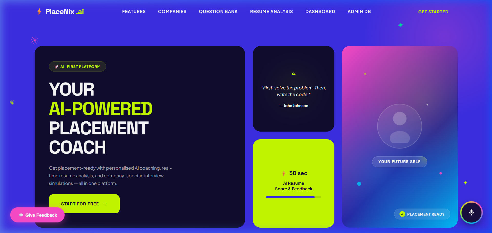
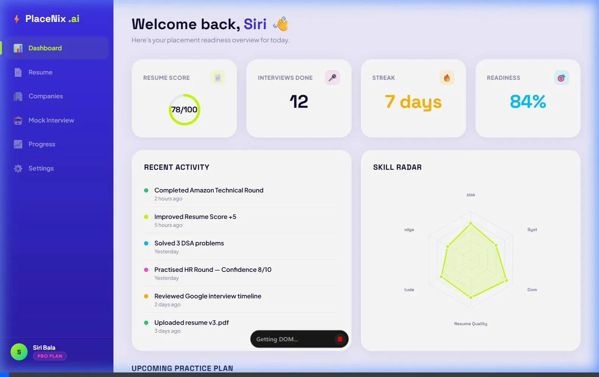
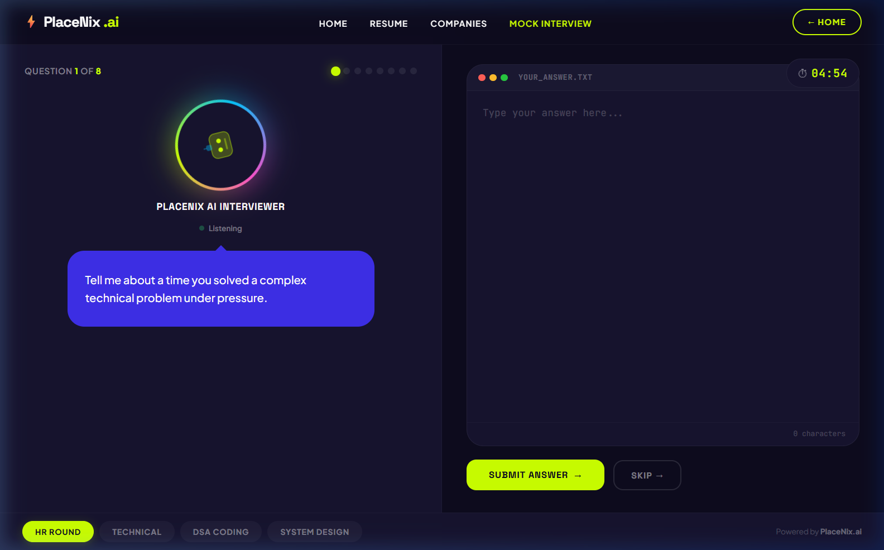
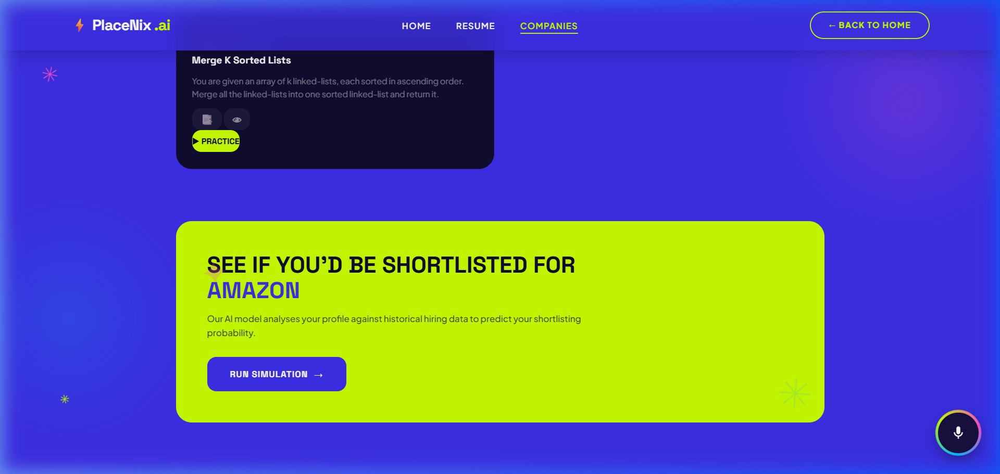
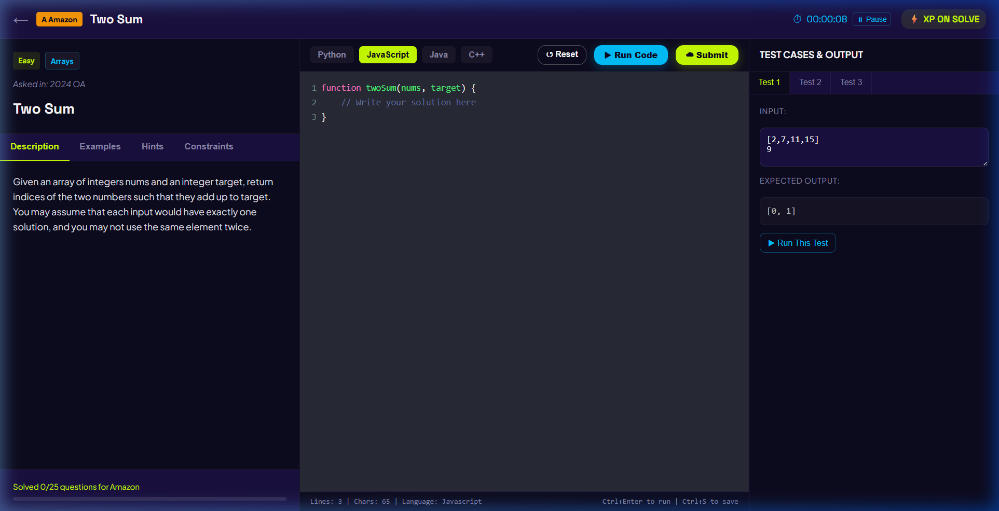
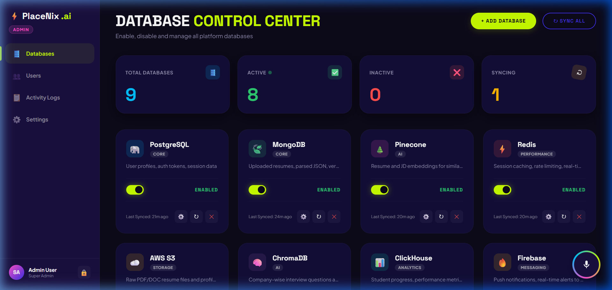

# PlaceNix.ai

Your Ultimate AI Placement Coach. PlaceNix.ai is a comprehensive platform designed to help students prepare for technical and HR interviews, practice coding questions, analyze their resumes, and track their overall placement readiness.

## 🚀 Features

- **AI Mock Interviews**: Practice HR, Technical, DSA, and System Design rounds with an interactive AI interviewer.
- **Company Workspaces & IDE**: Solve real interview questions previously asked at top companies like Amazon, Google, Microsoft, and TCS using our in-browser CodeMirror IDE.
- **Resume Analyzer**: Get instant, actionable feedback on your resume using AI analysis.
- **Progress Dashboard**: Track your solved problems, interview success rates, and resume iterations through an elegant dashboard.
- **Admin Control Center**: A secure backend-driven admin panel to manage users, databases, and platform settings.

## 📸 Screenshots

### Homepage


### Student Dashboard


### Mock Interview Session


### Company Workspaces


### Coding Playground (IDE)


### Admin Panel


## 🛠️ Technology Stack
- **Frontend**: HTML5, CSS3 (Glassmorphic Design), Vanilla JavaScript, Vite
- **Backend**: Node.js, Express.js
- **Database**: SQLite3 (better-sqlite3)
- **Authentication**: JWT & Custom PIN gates
- **AI Integration**: Gemini API for advanced conversational AI and analysis

## 🚦 Getting Started

1. **Install dependencies**
   ```bash
   npm install
   ```

2. **Start the development servers**
   ```bash
   npm run dev
   ```
   This will concurrently start the frontend (Vite) on port 8080 and the backend API (Express) on port 3000.

3. **Open the app**
   Navigate to `http://localhost:8080` in your browser.

## 🔒 Admin Access
To access the admin panel at `/admin.html`, you will need the 4-digit Admin PIN. (Default: `1234`)
